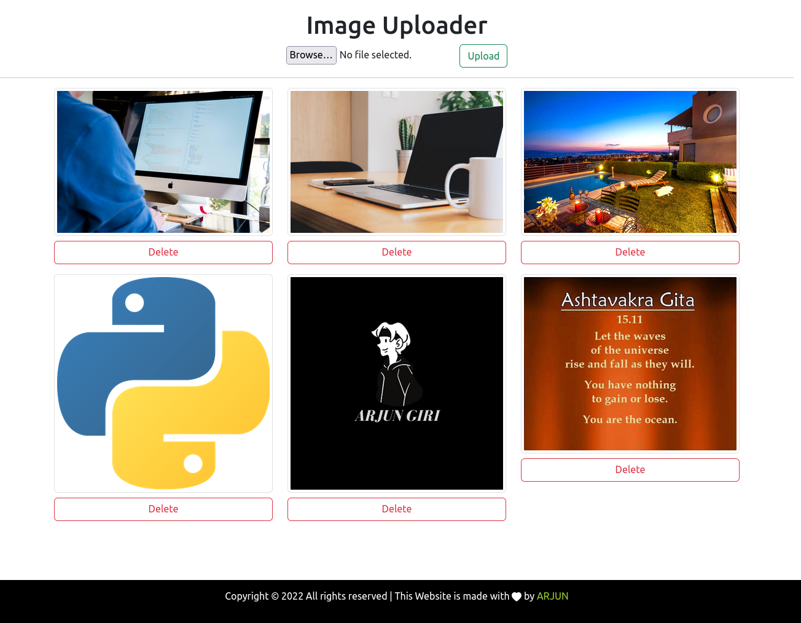

# Image Uploader In Django
In this project we will host our media files on Cloudinary server and deploy application on Heroku

# Project Live @https://dj-upload.herokuapp.com/

### Note: The live site is hosted on free tier of heroku, so it may take some time to load the data.


## Installation

Start by either Downloading Zip file or Clone the repo

```bash
  git clone https://github.com/giriarjun111/Image-Uploader.git
  cd Image-Uploader
```

```bash
  Create a virtual environment and activate
      pip install virtualenv
      virtualenv envname
  For Mac OS / Linux:
      source envname/bin/activate
  For Windows:
      envname\scripts\activate
```

## We will use https://cloudinary.com/ to host and serve media files. So, go ahead and create an account.

```bash
  Rename .env.example to .env and Add the values for the follwing or copy this:
    SECRET_KEY=a0kqo78v_8bv=5jkqbtgt$w3(h7xe&(bspu*6s+429=rh+2xd!
    DEBUG=True

    CLOUD_NAME = Cloudinary Cloud Name
    API_KEY = Cloudinary API Key
    API_SECRET = Cloudinary API Secret
```

```bash
  pip install -r requirements.txt
  python manage.py makemigrations
  python manage.py migrate
  python manage.py createsuperuser
  python manage.py runserver
```
    
## 🔗 Links
[](https://arjungiri.tk/)
[](https://www.linkedin.com/in/arjun-giri-full-stack-web-developer-08577519b/)
[](https://www.facebook.com/arjun.giri.5099940)


## Tech Stack

**Client:** HTML & CSS

**Server:** Django

## Screenshots
Home Page



